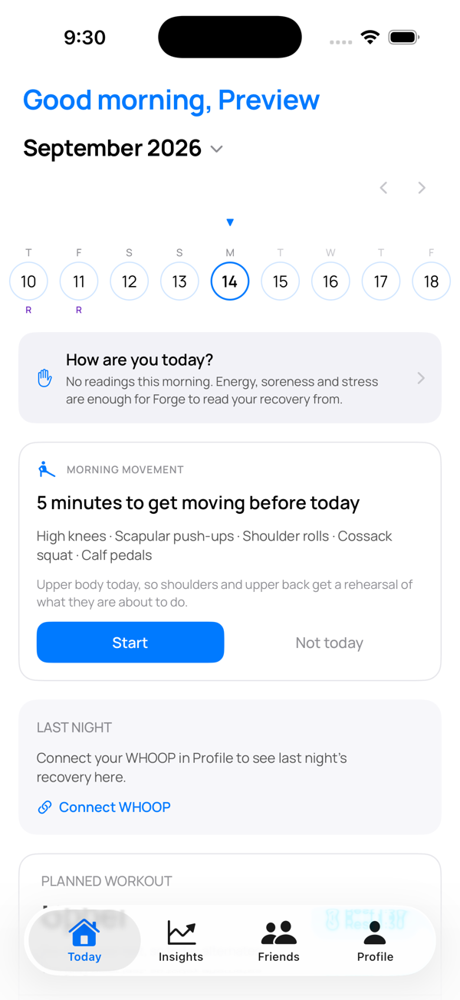
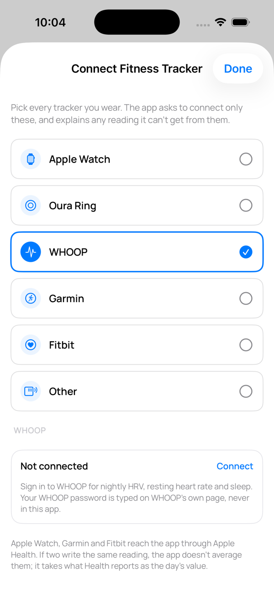
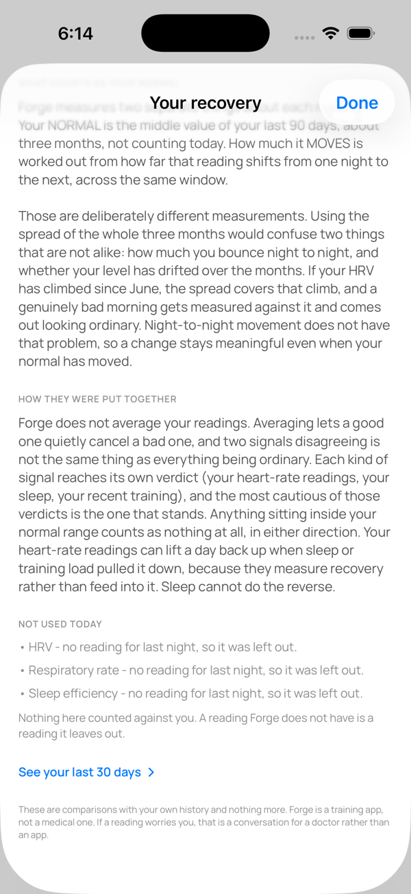
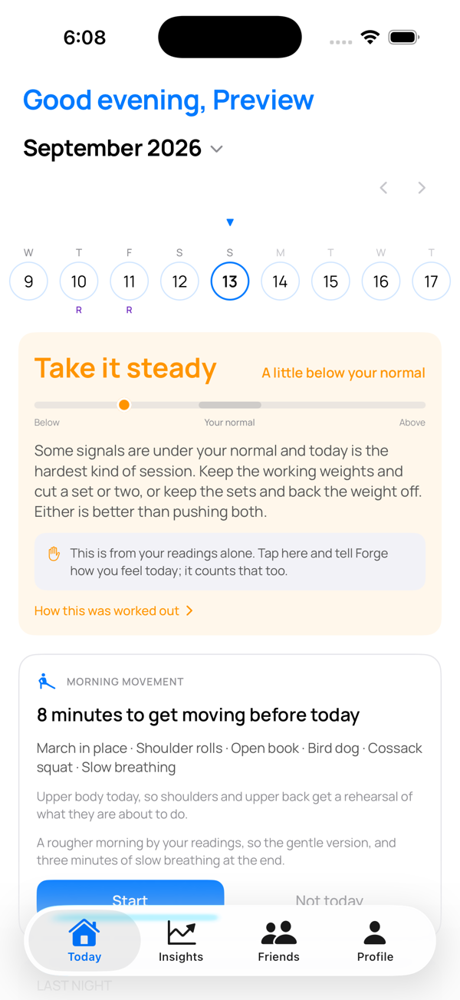

# Forge Fitness × WHOOP

How the WHOOP integration looks inside Forge Fitness (iOS, TestFlight beta).

**1. The Today screen for a WHOOP member who has not connected yet.** The recovery card offers Connect WHOOP.

**2. Profile › Connect Fitness Tracker.** Connect opens WHOOP's own sign-in in a secure iOS window; the app never sees the password.

**3. Once connected, last night's WHOOP readings drive the recovery band** (HRV, resting heart rate, sleep and respiratory rate, each against the member's own 28-day normal), and the band adjusts the day's session.

**4. The band on Today.**

Data handling is described in the [privacy policy](../), WHOOP section.
